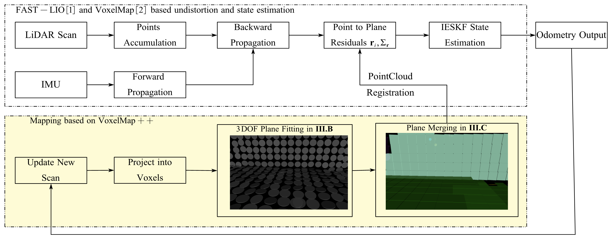

# VoxelMapPlus

## Voxelmap++: Mergeable Voxel Mapping Method for Online LiDAR(-inertial) Odometry
## Introduction

**VoxelMapPlus** is an expension with some new features about VoxelMap (https://github.com/hku-mars/VoxelMap) 
1. Incrementally 3DOF plane fitting and update method based on least squares estimation
2. Plane merging method based on union-find which consider the coplanar relationship between voxel
3. Computationally efficient, low memory usage
4. Adapt different kinds of LiDARs (multi-spinning LiDARs and non-conventional solid-state LiDARs)

    
    The framework about VoxelMap++

### Developers:
[Yuan You 游远](https://github.com/SunnysTaste)， [Yifei Yuan 袁翼飞](https://github.com/YYF)

### Related video
Our accompanying videos are now available on **Bilibili**.

    <a href="https://www.bilibili.com/video/BV16h4y1r7Cm/" target="_blank">

### Related paper
Related paper available on **arxiv**:  
1. [Voxelmap++: Mergeable Voxel Mapping Method for Online LiDAR(-inertial) Odometry](https://arxiv.org/abs/XXXXXX)(Not yet uploaded)
2. [Efficient and Probabilistic Adaptive Voxel Mapping for Accurate Online LiDAR Odometry](https://arxiv.org/abs/2109.07082)
3. [FAST-LIO2: Fast Direct LiDAR-inertial Odometry](https://arxiv.org/abs/2107.06829)

### Our codes and Datasets will be open-sourced after accepted.
