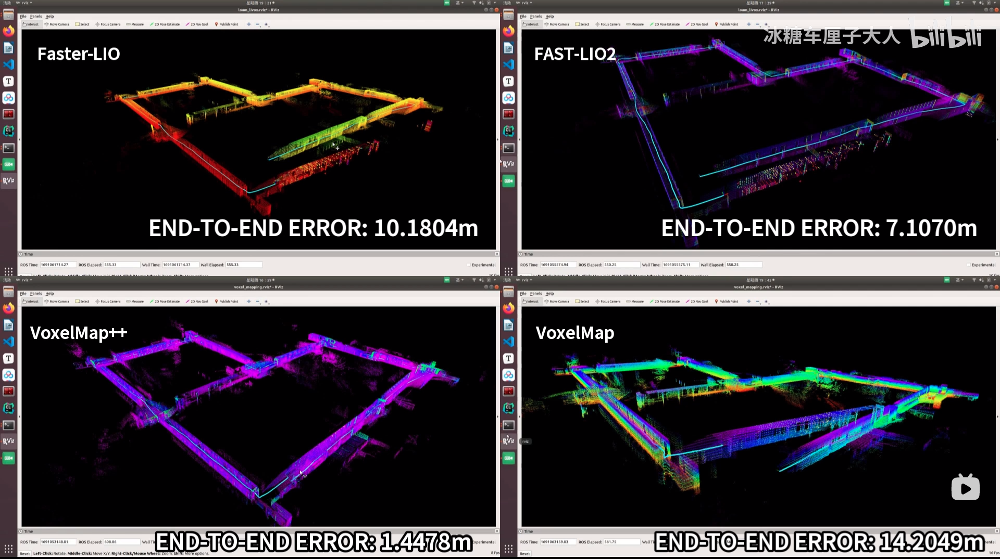

# VoxelMapPlus

## Voxelmap++: Mergeable Voxel Mapping Method for Online LiDAR(-inertial) Odometry
## Introduction

**VoxelMapPlus** is an expension with some new features about VoxelMap (https://github.com/hku-mars/VoxelMap) 
1. Incrementally 3DOF plane fitting and update method based on least squares estimation
2. Plane merging method based on union-find which consider the coplanar relationship between voxel
3. Computationally efficient, low memory usage
4. Adapt different kinds of LiDARs (multi-spinning LiDARs and non-conventional solid-state LiDARs)

<div align="center">
    
    <font color=#a0a0a0 size=2>The framework about VoxelMap++</font>
</div>

### Developers:
[Yuan You 游远](https://github.com/SunnysTaste)， [Yifei Yuan 袁翼飞](https://github.com/YYF)

### Related video
Our accompanying videos are now available on **Bilibili**.
<div align="center">
    <a href="https://www.bilibili.com/video/BV16h4y1r7Cm/" target="_blank">
    
</div>


### Related paper
Related paper available on **arxiv**:  
1. [Voxelmap++: Mergeable Voxel Mapping Method for Online LiDAR(-inertial) Odometry](https://arxiv.org/pdf/2308.02799.pdf)
2. [Efficient and Probabilistic Adaptive Voxel Mapping for Accurate Online LiDAR Odometry](https://arxiv.org/abs/2109.07082)
3. [FAST-LIO2: Fast Direct LiDAR-inertial Odometry](https://arxiv.org/abs/2107.06829)

## 1. Prerequisites
### 1.1. **PCL && Eigen**

PCL>= 1.8,   Follow [PCL Installation](http://www.pointclouds.org/downloads/linux.html).

Eigen>= 3.3.4, Follow [Eigen Installation](http://eigen.tuxfamily.org/index.php?title=Main_Page).

### 1.2. **livox_ros_driver**
Follow [livox_ros_driver Installation](https://github.com/Livox-SDK/livox_ros_driver).

## 2. Build
Clone the repository and catkin_make:
```
    cd ~/$A_ROS_DIR$/src
    git clone https://github.com/uestc-icsp/VoxelMapPlus_Public.git
    cd ..
    catkin_make
    source devel/setup.bash
```
- Remember to source the livox_ros_driver before build (follow 1.2 **livox_ros_driver**)

## 3. Run on Dataset
### 3.1 Run on Our LivoxHap Odometry dataset
Step A: Download Datasets
链接: https://pan.baidu.com/s/1-FXY-UDdfJ0O4S-IWwFBqg?pwd=ICSP 提取码: ICSP 

Step B: Setup before run
Edit ``` config/velodyne.yaml ``` to set the below parameters:
1. LiDAR point cloud topic name: ``` lid_topic ```
2. IMU topic name: ``` imu_topic ```
3. If you want to show the voxel map, set ```pub_voxel_map``` to ```true```
4. If you want to show the accumulated point cloud map, set ```pub_point_cloud``` to ```true```

Step C: Run below
```
    cd ~/$VOXEL_MAP_PLUS_ROS_DIR$
    source devel/setup.bash
    roslaunch voxel_map mapping_velodyne.launch
```

Step D: Play rosbag.
